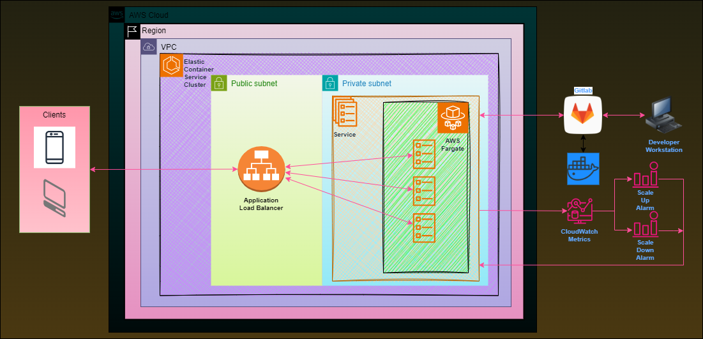

- [Oluşturulacak sistemin diyagram'ı](#oluşturulacak-sistemin-diyagramı)
- [Image'ın oluşturulması](#imageın-oluşturulması)
  - [Dockerfile](#dockerfile)
  - [Nginx yapılandırma dosyası /ReactApp/`nginx.conf`](#nginx-yapılandırma-dosyası-reactappnginxconf)
  - [Docker-compose dosyası, derlenmesi ve kaydedilmesi](#docker-compose-dosyası-derlenmesi-ve-kaydedilmesi)
- [Terraform ile AWS](#terraform-ile-aws)
- [CI/CD Pipeline](#cicd-pipeline)
- [Ansible ve Shell script ile disk kullanımı uyarı maili gönderilmesi](#ansible-ve-shell-script-ile-disk-kullanımı-uyarı-maili-gönderilmesi)
- [Kubernetes deployment](#kubernetes-deployment)


## Oluşturulacak sistemin diyagram'ı



## Image'ın oluşturulması

### Dockerfile
```Dockerfile
# Build the react app
FROM node:alpine AS builder
WORKDIR /app/src
COPY /ReactApp/package*.json .
RUN npm ci
COPY /ReactApp .
RUN npm run build

# Serve the application with nginx
FROM nginx:alpine
COPY /ReactApp/nginx.conf /etc/nginx/nginx.conf
RUN rm -rf /usr/share/nginx/html/*
COPY --from=builder /app/src/dist /usr/share/nginx/html
RUN apk update && apk upgrade --no-cache
EXPOSE 80 80
ENTRYPOINT ["nginx", "-g", "daemon off;"]
```

### Nginx yapılandırma dosyası /ReactApp/`nginx.conf`
```nginx
events { }
http {
    server {
      listen 80;
      server_name c_react_webui;

      location / {
        root /usr/share/nginx/html/;
        include /etc/nginx/mime.types;
        try_files $uri $uri/ /index.html;
      }
	}
}
```

### Docker-compose dosyası, derlenmesi ve kaydedilmesi
> Docker-compose.yml
```yml
version: "3.4"

services:
  react.web.ui:
    container_name: c_react_webui
    image: fatihdemirci/reactdeployment:latest
    build:
      dockerfile: "ReactApp/Dockerfile"
```
> Docker-compose.override.yml
```Dockerfile
version: "3.4"

services:
  react.web.ui:
    environment:
      - "NODE_ENV=production"
    ports:
      - "80:80"
```

> `docker-compose build` komutu ile image oluşturulur
> `docker push fatihdemirci/reactdeployment:latest komutu ile docker hub'a gönderilir


## Terraform ile AWS

```shell
export TF_VAR_secret_key=<YourSecretKey>
export TF_VAR_access_key=<YourAccessKey>
```
> komutlarıyla AWS secret key ve access key belirtilip
> export | grep TF komutu ile eklendiği teğit edilebilir
> terraform klasörü altında `terraform init` ardından `terraform apply` komutları çalıştırılarak AWS'de sistemin kurulması sağlanır
> AWS'de load Balancers altında http://reactapp-alb-1111111111.eu-south-1.elb.amazonaws.com/ gibi bir adresten erişilebilecek, taskların public IP'leri üzerindense erişilemeyecek şekilde sistem kurulmuş olur


## [CI/CD Pipeline](gitlab/)

## [Ansible ve Shell script ile disk kullanımı uyarı maili gönderilmesi](ansible/)

## [Kubernetes deployment](kubernetes/)