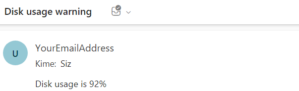

- [disk\_usage\_playbook.yml](#disk_usage_playbookyml)
- [disk\_usage.sh](#disk_usagesh)
- [send\_mail\_playbook.yml](#send_mail_playbookyml)
- [disk\_usage.log](#disk_usagelog)
- [Örnek yollanan mail görüntüsü](#örnek-yollanan-mail-görüntüsü)


## disk_usage_playbook.yml
> `disk_usage_playbook.yml` 6 saatte bir `disk_usage.sh` dosyasını çalıştırır ve çıktıları `disk_usage.log` dosyasına yazar
```yml
- hosts: localhost
  tasks:
    - name: Set up cron job to run disk usage script every six hours
      cron:
        name: Check disk usage
        user: "root"
        hour: "*/6"
        job: "/bin/sh /home/kali/Desktop/ansible/disk_usage.sh >> /home/kali/Desktop/ansible/disk_usage.log"
        cron_file: disk_usage
```

> `disk_usage_playbook.yml` Dosyasının çalıştırılması
```shell
└─# ansible-playbook disk_usage_playbook.yml
PLAY [localhost] ******************************************************************************************************************************************

TASK [Gathering Facts] ************************************************************************************************************************************
ok: [localhost]

TASK [Set up cron job to run disk usage script every day] *************************************************************************************************
ok: [localhost]

PLAY RECAP ************************************************************************************************************************************************
localhost                  : ok=2    changed=0    unreachable=0    failed=0    skipped=0    rescued=0    ignored=0
```

> crontab dosyası, cron_file kısmında belirtilen dosya ismiyle cron.d altında oluşur
```shell
──(kali㉿kali)-[/etc/cron.d]
└─$ ls
disk_usage  e2scrub_all  john  php  sysstat
┌──(kali㉿kali)-[/etc/cron.d]
└─$ cat disk_usage
#Ansible: Check disk usage
* */6 * * * root /bin/sh /home/kali/Desktop/ansible/disk_usage.sh >> /home/kali/Desktop/ansible/disk_usage.log
```

## disk_usage.sh
> `disk_usage.sh` dosyası, disk kullanımı belirlenen eşik değerinin üstündeyse `send_mail_playbook.yml` dosyasını subject ve body değerlerini vererek çalıştırır ve cron'u siler
```shell
# set the threshold percentage
THRESHOLD=90

# Get the disk usage value
USAGE=$(df / | tail -1 | awk '{print $5}' | sed 's/%//')

echo "$USAGE%"

# Check if the disk usage is above the threshold
if [ $USAGE -gt $THRESHOLD ]; then
  ansible-playbook /home/kali/Desktop/ansible/send_mail_playbook.yml -e "subject='Disk usage warning' body='Disk usage is $USAGE%'"
  rm /etc/cron.d/disk_usage
fi

echo "$(date)"
```

## send_mail_playbook.yml
> `send_mail_playbook.yml` dosyası
```yml
- hosts: localhost
  tasks:
    - name: Sending an email using Ansible
      mail:
        host: smtp-mail.outlook.com
        port: 587
        username: <username>
        from: <emailAddress>
        password: <password>
        to: <emailAddress>
        subject: "{{subject}}"
        body: "{{body}}"
```
## disk_usage.log
> `disk_usage.log` dosyası
```
29%
Sat Nov 11 11:01:01 AM EST 2023
40%
Sat Nov 11 17:01:01 AM EST 2023
58%
Sat Nov 11 23:01:01 AM EST 2023
75%
Sat Nov 12 05:01:01 AM EST 2023
92%

PLAY [localhost] ***************************************************************

TASK [Gathering Facts] *********************************************************
ok: [localhost]

TASK [Sending an email using Ansible] ******************************************
ok: [localhost]

PLAY RECAP *********************************************************************
localhost                  : ok=2    changed=0    unreachable=0    failed=0    skipped=0    rescued=0    ignored=0   

Sat Nov 12 11:01:01 AM EST 2023
```

## Örnek yollanan mail görüntüsü

