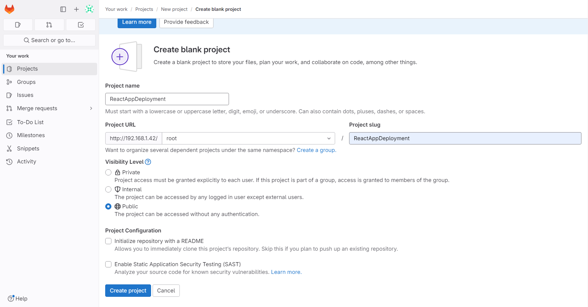
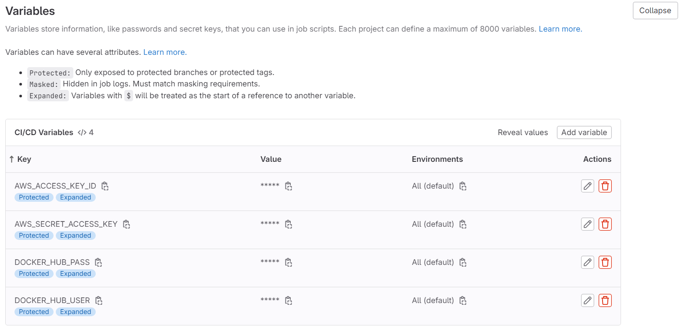
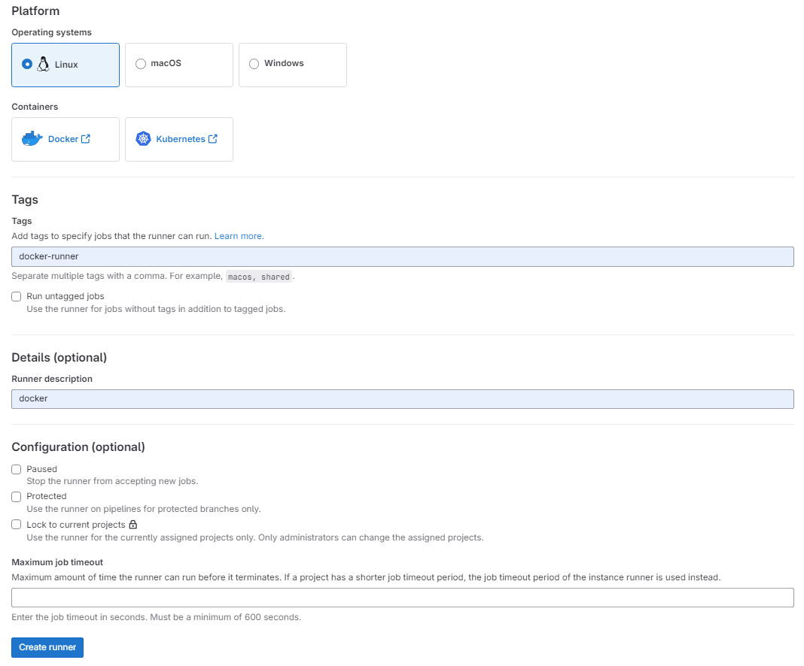
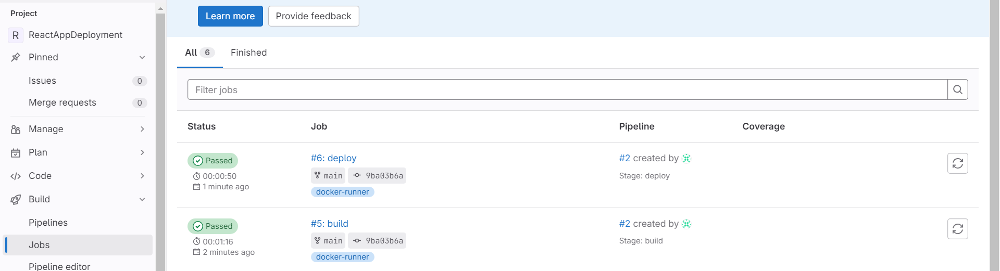
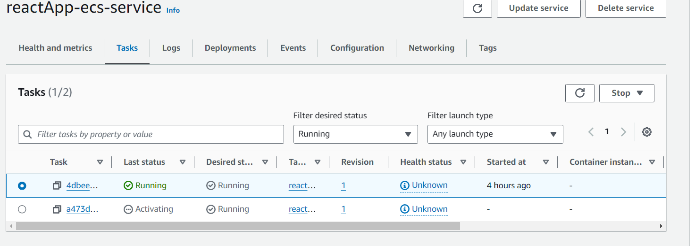
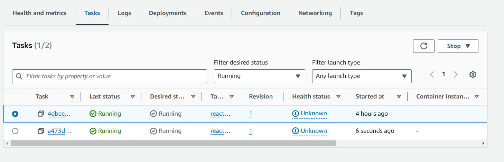
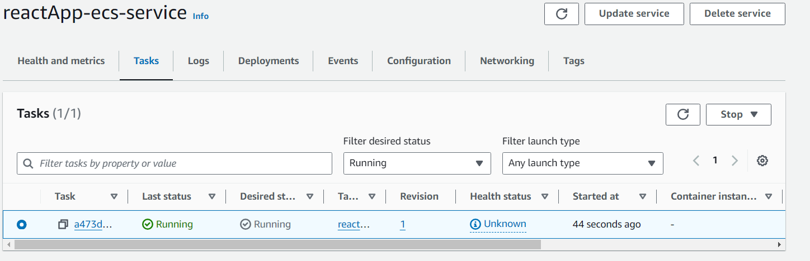

- [Gitlab ile CI/CD Pipeline](#gitlab-ile-cicd-pipeline)
  - [Gitlab ve Gitlab-runner çalıştırılması](#gitlab-ve-gitlab-runner-çalıştırılması)
    - [gitlab-compose dosyaları](#gitlab-compose-dosyaları)
    - [Çalıştırılması](#çalıştırılması)
  - [Parolanın alınıp giriş yapılması](#parolanın-alınıp-giriş-yapılması)
  - [Projenin oluşturulup dosyaların gönderilmesi](#projenin-oluşturulup-dosyaların-gönderilmesi)
  - [CI/CD Pipeline oluşturulması](#cicd-pipeline-oluşturulması)
  - [CI/CD Pipeline](#cicd-pipeline)


# Gitlab ile CI/CD Pipeline


## Gitlab ve Gitlab-runner çalıştırılması

### gitlab-compose dosyaları
> gitlab-compose.yml
```yml
version: "3.4"

services:
  gitlab:
    container_name: c_gitlab
    image: gitlab/gitlab-ce:latest

  gitlab-runner:
    container_name: c_gitlab_runner
    image: gitlab/gitlab-runner:latest
```
> gitlab-compose.override.yml
```yml
version: "3.4"

services:
  gitlab:
    restart: unless-stopped
    hostname: "<YourDomain>"
    environment:
      GITLAB_OMNIBUS_CONFIG: |
        external_url 'http://<YourDomain>'
    ports:
      - "443:443"
      - "80:80"
      - "22:22"
    # If you want to use bind mount, you can use this comment block instead of 'volumes' blocks
    # volumes:
    #   - /root/gitlab/config:/etc/gitlab
    #   - /root/gitlab/logs:/var/log/gitlab
    #   - /root/gitlab/data:/var/opt/gitlab
    volumes:
      - gitlabconfig:/etc/gitlab
      - gitlablogs:/var/log/gitlab
      - gitlabdata:/var/opt/gitlab
    networks:
      - gitlab-network

  gitlab-runner:
    restart: always
    volumes:
      - /root/gitlab-runner/config:/etc/gitlab-runner
      - /var/run/docker.sock:/var/run/docker.sock
    networks:
      - gitlab-network

networks:
  gitlab-network:
    name: gitlab-network

volumes:
  gitlabconfig:
  gitlablogs:
  gitlabdata:
```

### Çalıştırılması
```shell
docker-compose -f gitlab-compose.yml -f gitlab-compose.override.yml up -d
Network gitlab-network  Creating
Network gitlab-network  Created
Volume "gitlab_gitlabconfig"  Creating
Volume "gitlab_gitlabconfig"  Created
Volume "gitlab_gitlablogs"  Creating
Volume "gitlab_gitlablogs"  Created
Volume "gitlab_gitlabdata"  Creating
Volume "gitlab_gitlabdata"  Created
Container c_gitlab_runner  Creating
Container c_gitlab  Creating
Container c_gitlab_runner  Created
Container c_gitlab  Created
Container c_gitlab_runner  Starting
Container c_gitlab  Starting
Container c_gitlab_runner  Started
Container c_gitlab  Started
```
> Komutu ile gitlab ve gitlab-runner ayağa kaldırılır.


## Parolanın alınıp giriş yapılması

```shell
# Connect the c_gitlab container with bash
docker exec -it c_gitlab bash
# Show the initial_root_password file's content
root@192: cat /etc/gitlab/initial_root_password
# WARNING: This value is valid only in the following conditions
#          1. If provided manually (either via `GITLAB_ROOT_PASSWORD` environment variable or via `gitlab_rails['initial_root_password']` setting in `gitlab.rb`, it was provided before
database was seeded for the first time (usually, the first reconfigure run).
#          2. Password hasn't been changed manually, either via UI or via command line.
#
#          If the password shown here doesn't work, you must reset the admin password following https://docs.gitlab.com/ee/security/reset_user_password.html#reset-your-root-password.

Password: m5CgF9GbHaOuJedVN1nXJhf55GpYNeBwqUsvGqEW2Sw=

# NOTE: This file will be automatically deleted in the first reconfigure run after 24 hours.
```

> root kullanıcı adı ve komutların ardından elde edilen 'Password:' alanındaki parola ile gitlab'a 80 portu üzerinden giriş yapılır.

## Projenin oluşturulup dosyaların gönderilmesi

> Create blank project denilip görseldeki gibi proje oluşturulur.


```git
git init --initial-branch=main && git remote add origin http://192.168.1.42/root/ReactAppDeployment git && git add . && git commit -m "."
```
> komutunun ardından `git push --set-upstream origin main` çalıştırılıp kullanıcı adı ve parola girilerek dosyalar repository'ye gönderilir.

## CI/CD Pipeline oluşturulması

> Settings --> CI/CD --> Variables altından ilgili değerler girilir.


> Settings --> CI/CD --> Runners --> New project runner altından görseldeki şekilde bir runner oluşturulur ve register komutu alınır.


```shell
docker exec -it c_gitlab_runner bash
```
> Komutu ile gitlab-runner'a bağlanılır.

```shell
root@14be1ce38fb0: gitlab-runner register  --url http://<YourDomain>  --token <YourToken>
Runtime platform                                    arch=amd64 os=linux pid=393 revision=853330f9 version=16.5.0
Running in system-mode.

Enter the GitLab instance URL (for example, https://gitlab.com/):
[http://192.168.1.42]:
Verifying runner... is valid                        runner=sB5QrxsbT
Enter a name for the runner. This is stored only in the local config.toml file:
[14be1ce38fb0]: runnerDocker
Enter an executor: custom, docker, shell, virtualbox, docker-autoscaler, instance, kubernetes, docker-windows, parallels, ssh, docker+machine:
docker
Enter the default Docker image (for example, ruby:2.7):
alpine
Runner registered successfully. Feel free to start it, but if it's running already the config should be automatically reloaded!

Configuration (with the authentication token) was saved in "/etc/gitlab-runner/config.toml"

root@14be1ce38fb0: sed -i 's,privileged = false,privileged = true,g' /etc/gitlab-runner/config.toml
```

> Alınan register komutu ile config.toml dosyası oluşturulmuş olur. Ardından çalıştırılan komut ile runner üzerinden docker üzerinde komut çalıştırabilmesi için privileged değeri true yapılır.

> config.toml
```toml
concurrent = 1
check_interval = 0
shutdown_timeout = 0

[session_server]
  session_timeout = 1800

[[runners]]
  name = "runnerDocker"
  url = "http://<YourDomain>"
  id = 1
  token = "<YourToken>"
  token_obtained_at = 2023-11-12T16:40:49Z
  token_expires_at = 0001-01-01T00:00:00Z
  executor = "docker"
  [runners.cache]
    MaxUploadedArchiveSize = 0
  [runners.docker]
    tls_verify = false
    image = "alpine"
    privileged = true
    disable_entrypoint_overwrite = false
    oom_kill_disable = false
    disable_cache = false
    volumes = ["/cache"]
    shm_size = 0
    network_mtu = 0
```

## CI/CD Pipeline

> .gitlab-ci.yml
```yml
image: docker

variables:
    IMAGE: "fatihdemirci/reactdeployment"
    DOCKER_DRIVER: overlay2
    DOCKER_HOST: tcp://docker:2375/
    DOCKER_TLS_CERTDIR: ""
    AWS_DEFAULT_REGION: 'eu-south-1'
    ECS_SERVICE: 'reactApp-ecs-service'
    ECS_CLUSTER: 'reactApp-ecs-cluster'

services:
    - docker:dind

stages:
    - build
    - deploy

build:
    stage: build
    script:
        - docker login -u $DOCKER_HUB_USER -p $DOCKER_HUB_PASS
        - docker-compose build
        - docker push $IMAGE:latest
    tags:
        - docker-runner
deploy:
    stage: deploy
    script:
        - apk add --no-cache curl python3 py3-pip
        - pip install awscli
        - aws configure set aws_access_key_id $AWS_ACCESS_KEY_ID
        - aws configure set aws_secret_access_key_id $AWS_SECRET_ACCESS_KEY
        - aws configure set region AWS_DEFAULT_REGION
        - aws ecs update-service --cluster $ECS_CLUSTER --service $ECS_SERVICE  --force-new-deployment
    tags:
        - docker-runner
```
> build stage'inde repository'deki kodları derleyip image'ı oluşturarak docker hub'a gönderir.
> deploy stage'inde aws için access ve secret key'i kullanarak servisin yeni versiyon üzerinden yayına geçmesi sağlanır.


> Yeni bir push geldiğinde Build --> Jobs altından build ve deploy stage'leri takip edilebilir.


> build ve deploy stage'lerinin ardından AWS'te güncel versiyona geçiş takip edilebilir.



