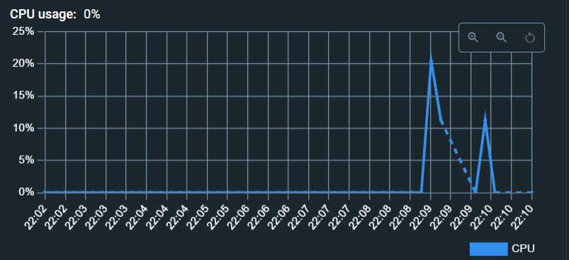
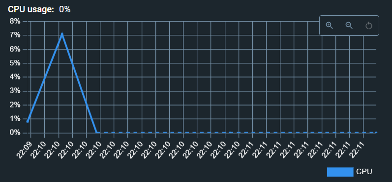

- [Kubernetes ile deployment](#kubernetes-ile-deployment)
  - [metrics-server](#metrics-server)
  - [Deployment dosyası](#deployment-dosyası)
  - [HorizontalPodAutoscaler](#horizontalpodautoscaler)
  - [Servis](#servis)
  - [Ölçekleme örneği](#ölçekleme-örneği)


# Kubernetes ile deployment

## metrics-server
> Eğer metrics-server kurulu değilse `kubectl apply -f metrics-server.yaml` komutu, CPU kullanımı gibi bilgilerin HorizontalPodAutoscaler tarafından okunabilmesi için çalıştırılır.

## Deployment dosyası
`react-app-deployment.yaml`
```yaml
apiVersion: apps/v1
kind: Deployment
metadata:
  name: react-app-deployment
spec:
  replicas: 1
  selector:
    matchLabels:
      app: react-app
  template:
    metadata:
      labels:
        app: react-app
    spec:
      containers:
        - name: react-app-container
          imagePullPolicy: Always
          image: fatihdemirci/reactdeployment
          resources:
            requests:
              memory: "64Mi"
              cpu: "128m"
            limits:
              memory: "128Mi"
              cpu: "256m"
          ports:
            - containerPort: 80
```

> `kubectl apply -f react-app-deployment.yaml` komutu ile deployment oluşturulur.

## HorizontalPodAutoscaler
`react-app-hpa.yaml`
```yaml
apiVersion: autoscaling/v2
kind: HorizontalPodAutoscaler
metadata:
  name: react-app-hpa
spec:
  scaleTargetRef:
    apiVersion: apps/v1
    kind: Deployment
    name: react-app-deployment
  minReplicas: 1
  maxReplicas: 10
  metrics:
    - type: Resource
      resource:
        name: cpu
        target:
          type: Utilization
          averageUtilization: 50
```

> deployment'ın pod'larının ölçeklenebilmesi için `kubectl apply -f react-app-hpa.yaml` komutu ile HorizontalPodAutoscaler oluşturulur. Bu dosyadaki spec/scaleTargetRef altındaki bilgiler ölçeklendirilecek olan deployment'ın bilgileridir. spec/metrics ise ölçeklemenin neye göre yapılacağının yapılandırmasıdır.

## Servis
`react-app-service.yaml`
```yaml
apiVersion: v1
kind: Service
metadata:
  name: react-app-service
spec:
  type: LoadBalancer
  selector:
    app: react-app
  ports:
    - protocol: TCP
      port: 80
      targetPort: 80
```
> Podlara dışarıdan erişilebilmesi için `kubectl apply -f react-app-service.yaml` komutu ile LoadBalancer servisi oluşturulur. spec/selector/app ismi erişilecek olan deployment'ın spec/selector/matchLabels/app bilgisidir.

## Ölçekleme örneği
> İlk oluşturulan pod



> İlk pod'a yük geldiği için oluşturulan ikinci pod

